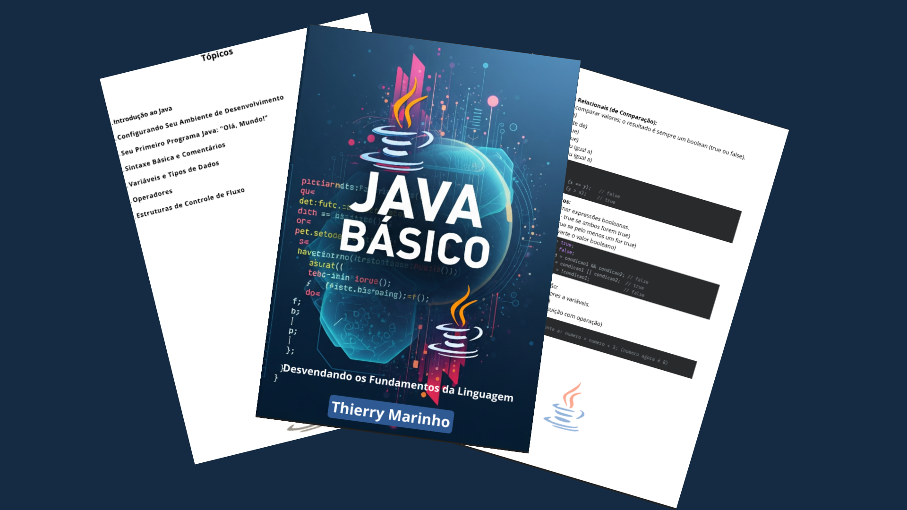

    

-------

# Projeto EBOOK Gerado por I.A.s

 > ℹ️ **NOTE:** Este é o repositório desenvolvido durante o curso na plataforma da [DIO](https://dio.me)

Projeto com o objetivo de gerar um ebook digital com as facilidades das ferramentas de IA. todos os prompts
seguem abaixo.

<a href="https://github.com/thierrysm/prompts-recipe-to-create-a-ebook/blob/main/src/ebook-java-basico.pdf" title="View PDF now"> 📕Clique aqui para ler</a>

## 💻 Tecnologias utilizadas no projeto

- [Google Gemini 2.5 Pro](https://gemini.google.com/) 
- [Canva](https://www.canva.com/)

## 🧠 Prompts

Gemini 2.5 Pro：

|   Ação   | prompt                                                                                                                                                                                                                                                                         |
| :------: | ------------------------------------------------------------------------------------------------------------------------------------------------------------------------------------------------------------------------------------------------------------------------------ |
|  título  | Cria a capa de um ebook com titulo Java básico e alguma arte relacionada ao java.                                                                                                                                                                                              |
| conteúdo | Faça um resumo com os principais tópicos do java básico para um iniciante compreender, com exemplos simples de códigos e textos curtos com clareza.                                                                                                                            |

## ✨ Features

- Conteúdo gerado via Gemini 2.5 Pro
- Imagens geradas via Gemini 2.5 Pro

## 📚 Materiais

- Imagens utilizadas em `assets`
- ebook gerado durante as aulas em `src`

## 🛠️ Instruções para leitura

 - Apenas abre o arquivo ebook-java-basico.pdf na pasta /src ou clique nesse <a href="https://github.com/thierrysm/prompts-recipe-to-create-a-ebook/blob/main/src/ebook-java-basico.pdf" title="View PDF now">aqui</a>
